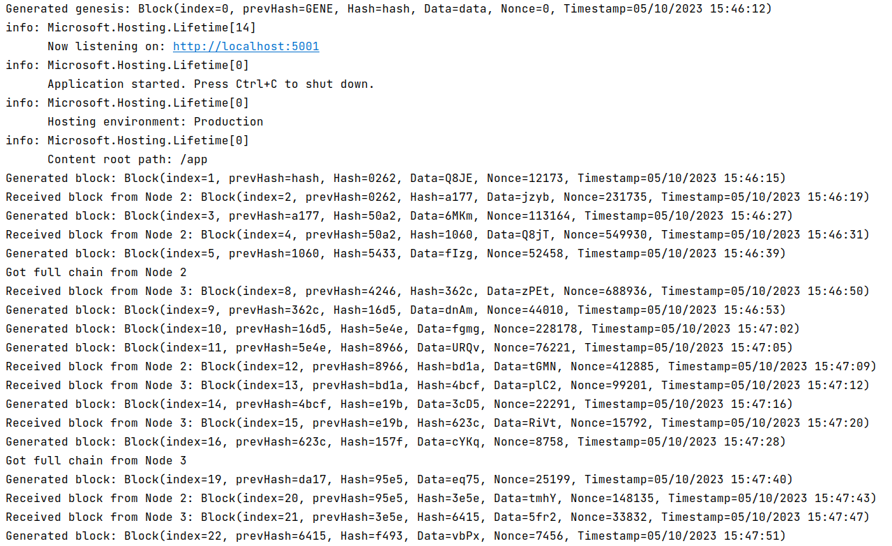
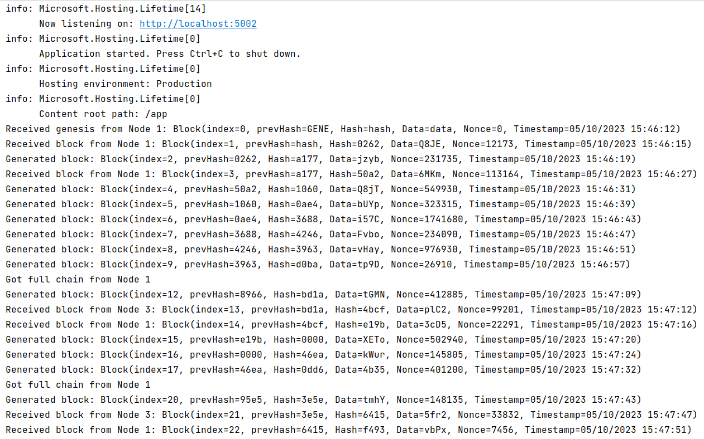
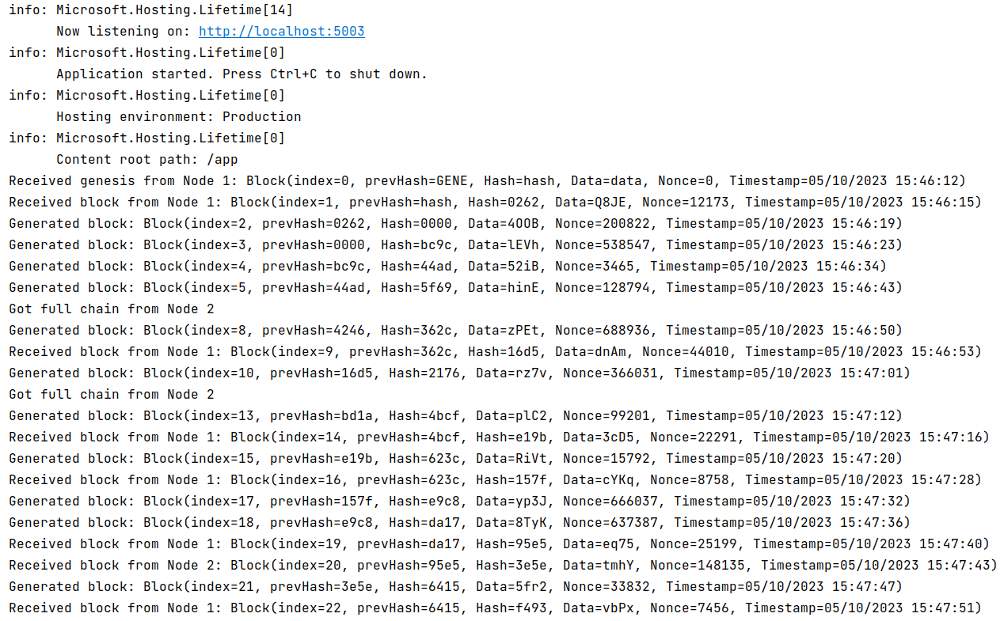

# Blockchain in .NET


Simple blockchain implementation for [Network Programming course](https://github.com/SemenMartynov/Software-Engineering-2022/blob/main/NetworkProgrammingTask.md)

## Run

* Clone

```
git clone https://github.com/Relfick/SharpChain.git
```

* Go to the solution root folder

```
cd <YOUR_PATH>/SharpChain
```

* Run docker compose

```
docker compose up
```

## Demonstration

* node1 (generated genesis)



* node2



* node3




